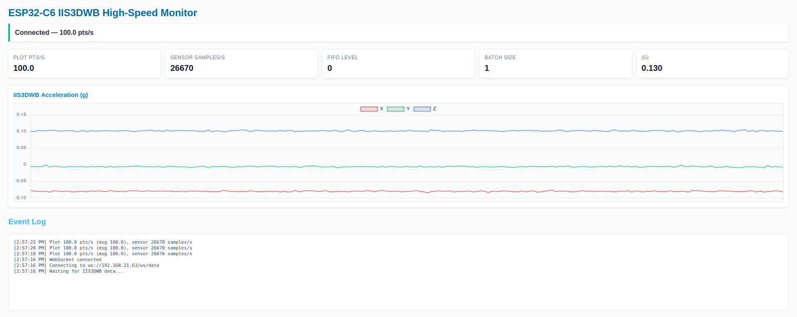

# ESP32-C6 IIS3DWB High-Speed Web Monitor

**English:** ESP32-C6 firmware dedicated to the IIS3DWB accelerometer with high-rate capture, live web UI, REST endpoints, and UDP IP broadcast.

**Tiếng Việt:** Firmware ESP32-C6 dành riêng cho IIS3DWB, hỗ trợ đọc tốc độ cao, dashboard realtime, API REST và broadcast IP qua UDP.



## Features / Tính năng

- **26.7 kHz acquisition:** IIS3DWB via SPI + DMA, WebSocket push ~100 Hz.
- **Embedded dashboard:** HTML/JS bundled, Chart.js live plot, FIFO/ODR stats.
- **REST + export:** `/api/data`, `/api/stats`, `/api/download?format=csv|json`.
- **UDP discovery:** `udp_broadcast_task` sends `ESP32 IP: ...` every 5 s to `255.255.255.255:12345`.
- **Lightweight logging:** ESP-IDF logs & WebSocket console for drop diagnostics.

## Hardware / Phần cứng

- ESP32-C6 dev board (5 V via USB).
- IIS3DWB SPI wiring (mặc định):
  - MISO → GPIO2, MOSI → GPIO7, SCK → GPIO6, CS → GPIO19
  - INT1 (optional watermark) → GPIO4
  - 3V3 & GND nguồn
- Edit pins in `main/imu_manager.c` if hardware differs.

## Build & Flash / Biên dịch & nạp

```bash
git clone https://github.com/hbqtechnologycompany/ESP32-C6-Multi-Sensor-IMU-Module.git
cd ESP32-C6-Multi-Sensor-IMU-Module/ESP32C6_IIS3_WebMonitor_HighSpeed
idf.py set-target esp32c6
idf.py menuconfig        # optional
```

Update Wi-Fi in `main/main.c`:
```c
#define WIFI_SSID "TenWifi"
#define WIFI_PASS "MatkhauWifi"
```

Build & flash:
```bash
idf.py build
idf.py -p /dev/ttyUSB0 flash monitor
```
Check serial log for `got ip:` and FIFO status.

## Usage / Sử dụng

- **Web UI:** open `http://hbq-imu.local` or `http://<ip>` for live X/Y/Z plots & metrics.
- **WebSocket:** `ws://<ip>/ws/data` (compact JSON) for custom clients.
- **REST:** use curl/Postman with endpoints listed in Features.
- **UDP helper:** `python ../receiver_ip.py`, `nc -ul 12345` (Linux) or `ncat -ul 12345` (Windows/Ncat) to catch broadcast IP.

## Quick config notes / Ghi chú cấu hình

- Adjust IIS3DWB ODR/full-scale in `imu_manager_init()`.
- Modify buffer size (`DATA_BUFFER_SIZE`) in `main/data_buffer.h` if RAM tight.
- Task priorities: IMU (5), Web server (4), UDP broadcast (5).
- LED status reuses WebMonitor logic (GPIO18, active-low).

## Troubleshooting / Khắc phục nhanh

- **No IP broadcast:** verify Wi-Fi credentials, watch serial, run UDP helper.
- **WebSocket lag:** reduce `points_per_frame` in `main/web_server.c` or increase FIFO watermark.
- **Sensor not detected:** recheck SPI wiring, power, observe `IIS3DWB` logs in init.

## License

MIT License © HBQ Technology. Contact `sales@hbq.com.vn` for kits or support.
