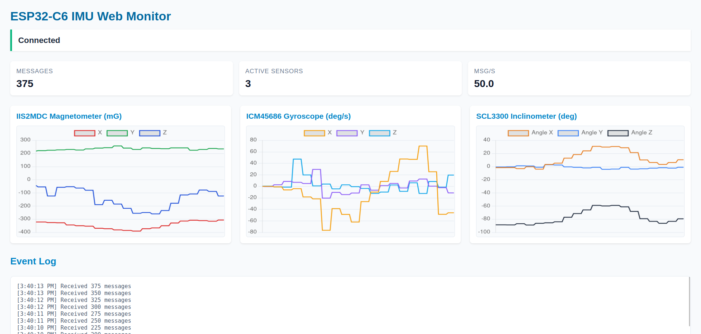

# ESP32-C6 IMU Web Monitor (Wi-Fi & BLE)

**English:** Unified Wi-Fi dashboard and BLE streamer for four IMU classes on ESP32-C6, covering web UI, REST API, and BLE notifications in a single firmware.

**Tiếng Việt:** Firmware hợp nhất cho ESP32-C6 giúp giám sát IMU qua web, API REST và streaming BLE, hỗ trợ đồng thời nhiều cảm biến.



## Features / Tính năng

- **Live Web Dashboard / Bảng điều khiển realtime:** WebSocket push ~50 Hz, biểu đồ Chart.js và thống kê trạng thái.
- **Multi-Sensor Fusion / Đa cảm biến:** IIS2MDC, IIS3DWB, ICM45686, SCL3300 đọc song song, đồng bộ thời gian.
- **BLE Notify Stream / Truyền BLE:** GATT service UUID 0x1815, characteristic 0x2A58 với frame nhị phân tương tự dự án BLE streamer.
- **REST + Download / API & xuất dữ liệu:** `GET /api/data`, `/api/stats`, `/api/download?(csv|json)` cho tích hợp ứng dụng khác.
- **IP Discovery / Tìm IP:** Broadcast UDP mỗi 5 s tới `255.255.255.255:12345`, kèm script `receiver_ip.py` để nghe nhanh.
- **mDNS & LED state / mDNS & LED báo:** Truy cập `http://hbq-imu.local`, LED GPIO18 báo các chế độ Wi-Fi/BLE/stream.

## Hardware & Requirements / Phần cứng & yêu cầu

- ESP32-C6 dev board, nguồn 5 V USB.
- Cảm biến IIS2MDC (I2C), IIS3DWB, ICM45686, SCL3300 (SPI). Mặc định dùng GPIO: SDA23, SCL22, MISO2, MOSI7, CLK6, CS{19,20,11}.
- ESP-IDF ≥ v5.4 đã export môi trường (`. $IDF_PATH/export.sh`).
- Mạng Wi-Fi 2.4 GHz, BLE central (ví dụ nRF Connect) để test notify.

## Build & Flash / Biên dịch & nạp

```bash
git clone https://github.com/hbqtechnologycompany/ESP32-C6-Multi-Sensor-IMU-Module.git
cd ESP32-C6-Multi-Sensor-IMU-Module/ESP32C6_IMU_WebMonitorw
idf.py set-target esp32c6                   # chọn chip
idf.py menuconfig                           # tùy chọn (ví dụ cấu hình Flash)
```

Chỉnh Wi-Fi trong `main/main.c`:
```c
#define WIFI_SSID  "TenWifi"
#define WIFI_PASS  "MatkhauWifi"
```

Sau đó build & flash:
```bash
idf.py build
idf.py -p /dev/ttyUSB0 flash monitor
```
Xem log để lấy IP (`got ip: 192.168.x.x`) và trạng thái BLE.

## Using the firmware / Sử dụng firmware

### 1. Web dashboard
- **English:** Open `http://hbq-imu.local` (mDNS) or `http://<device-ip>` in a browser to view live charts, sensor cards, stats, and export buttons.
- **Tiếng Việt:** Mở trình duyệt tới mDNS hoặc IP để xem biểu đồ realtime, số liệu thống kê và tải CSV/JSON.

### 2. REST API
- `GET /api/data` → latest sample.
- `GET /api/stats` → buffer counters, throughput.
- `GET /api/download?format=csv|json` → recent ring-buffer snapshot.

### 3. BLE streaming
- **Pairing:** Dùng app nRF Connect, LightBlue hoặc ESPVTool, tìm thiết bị tên `IMU-BLE`.
- **Enable notify:** Subscribe characteristic `0x2A58`. Mỗi frame chứa header (độ dài, timestamp, mask) + payload dạng TLV (accel, gyro, mag, inclinometer).
- **Decode:** Xem `main/imu_ble.c` để ánh xạ type ID hoặc reuse client từ dự án BLE streamer.

### 4. UDP IP broadcast helper
- **Script:** Từ thư mục gốc repo chạy `python3 receiver_ip.py` để in mọi bản tin broadcast 5 s/lần.
- **Linux CLI:** `nc -ul 12345` (hoặc `socat - UDP4-RECV:12345` nếu muốn xem chi tiết).
- **Windows:** `python receiver_ip.py` (với Python 3) hoặc `ncat -ul 12345` (khi đã cài Nmap/Ncat).

## Configuration highlights / Cấu hình nhanh

- **Sensor setup:** `main/imu_manager.c` có map chân và cấu hình SPI/I2C. Đổi CS hoặc bus nếu phần cứng khác.
- **Sampling & buffer:** `imu_manager_set_sampling_rate`, `DATA_BUFFER_SIZE` (trong `data_buffer.h`) và tần số BLE (`imu_ble_config_t` tại `main/main.c`).
- **LED states:** `LED_STATUS_NO_WIFI` (sáng), `LED_STATUS_WIFI_CONNECTED` (nhấp nháy 0.5 s), data pulse tắt/bật ngắn khi gửi qua BLE/WebSocket.
- **Tasks:** `imu_task` đọc cảm biến 100 Hz, `web_server_task` phục vụ HTTP/WebSocket, BLE producer phụ trách notify (FreeRTOS core 0).

## Troubleshooting / Khắc phục nhanh

- **Không thấy IP:** chắc chắn đã cấu hình Wi-Fi đúng, xem serial log và thử script `receiver_ip.py` để xác nhận broadcast.
- **BLE disconnect:** đảm bảo central bật notify, giữ khoảng cách <5 m; nếu frame quá dài có thể giảm `packet_interval_ms` hoặc tắt bớt cảm biến trong `imu_ble_config_t`.
- **Web UI không load:** kiểm tra SPIFFS đã mount, log `web_server_task`; thử truy cập `/api/data` để so sánh.
- **Hiệu suất:** theo dõi `esp_get_free_heap_size()` trong log, giảm `DATA_BUFFER_SIZE` hoặc tắt sensor không cần thiết.

## License

MIT License © HBQ Technology. Contributions welcome via pull request. | Giấy phép MIT, chấp nhận đóng góp qua PR.

[VI] Giám sát & Gỡ lỗi

### Built-in Statistics
- Total samples collected
- Dropped samples count
- Buffer overflow events
- Average processing time
- Memory usage statistics

### Logging
Enable debug logging:
```c
esp_log_level_set("*", ESP_LOG_DEBUG);
```

### Performance Monitoring
```c
// Measure operation time
int64_t start_time = esp_timer_get_time();
// ... operation ...
int64_t end_time = esp_timer_get_time();
ESP_LOGI("PERF", "Operation took %lld us", end_time - start_time);
```

## 🛠️ Troubleshooting

### Common Issues

1. **WiFi Connection Failed**
   - Check WiFi credentials
   - Verify signal strength
   - Check firewall settings

2. **Sensor Initialization Failed**
   - Check wiring connections
   - Verify GPIO configuration
   - Check power supply

3. **Web Interface Not Loading**
   - Check IP address in serial monitor
   - Verify SPIFFS partition
   - Check web server status

4. **High CPU Usage**
   - Reduce sampling rates
   - Optimize data processing
   - Check task priorities

### Debug Commands

Monitor system status:
```bash
# Check free heap
idf.py monitor

# Check task status
# Look for task stack usage in logs

# Check WiFi status
# Look for IP address in startup logs
```

## 📈 Data Analysis

### Real-time Visualization
The web interface provides:
- **Time-series Charts**: Live sensor data plotting
- **Multi-axis Display**: Simultaneous sensor monitoring
- **Statistical Analysis**: Mean, variance, peak detection
- **Frequency Analysis**: FFT for vibration analysis

### Data Export
- **CSV Format**: Compatible with Excel, MATLAB, Python
- **JSON Format**: Structured data for web applications
- **Real-time Streaming**: WebSocket for live data

## 🔮 Future Enhancements

### Planned Features
- **Machine Learning**: Pattern recognition and anomaly detection
- **Cloud Integration**: AWS IoT, Azure IoT Hub support
- **Mobile App**: Native mobile application
- **Advanced Analytics**: Statistical analysis and reporting
- **Multi-device Support**: Network of synchronized sensors

### Performance Improvements
- **Edge Computing**: On-device data processing
- **Compression**: Data compression for storage
- **Caching**: Intelligent data caching
- **Load Balancing**: Multiple web server instances

## 💰 Support & Purchase

### Buy the CM5 Gateway Kit
**Store**: [HBQ Technology Store](https://store.hbqsolution.com/)

**Contact Information**:
- Email: contact@hbqsolution.com | hbqsolution@gmail.com
- Phone: (+84) 035 719 1643 | (+84) 094 850 7979
- Address: 31, Đường số 8, Cityland Garden Hill, P. An Nhơn, TP HCM

### Support the Project
- **PayPal Donate**: [Donate via PayPal](https://paypal.me/hbqtechnology)
- **GitHub Sponsors**: [Support on GitHub](https://github.com/sponsors/hbqtechnologycompany)

## 📚 Documentation

- [Main Project README](../README.md)
- [Detailed Guide](../DETAILED_GUIDE.md)
- [API Documentation](docs/API.md)
- [Hardware Guide](docs/HARDWARE.md)

## 🤝 Contributing

1. Fork the repository
2. Create a feature branch
3. Make your changes
4. Add tests if applicable
5. Submit a pull request

## 📄 License

This project is licensed under the MIT License - see the [LICENSE](../LICENSE) file for details.

---

**Built for high-performance IMU monitoring with modern web technologies**
